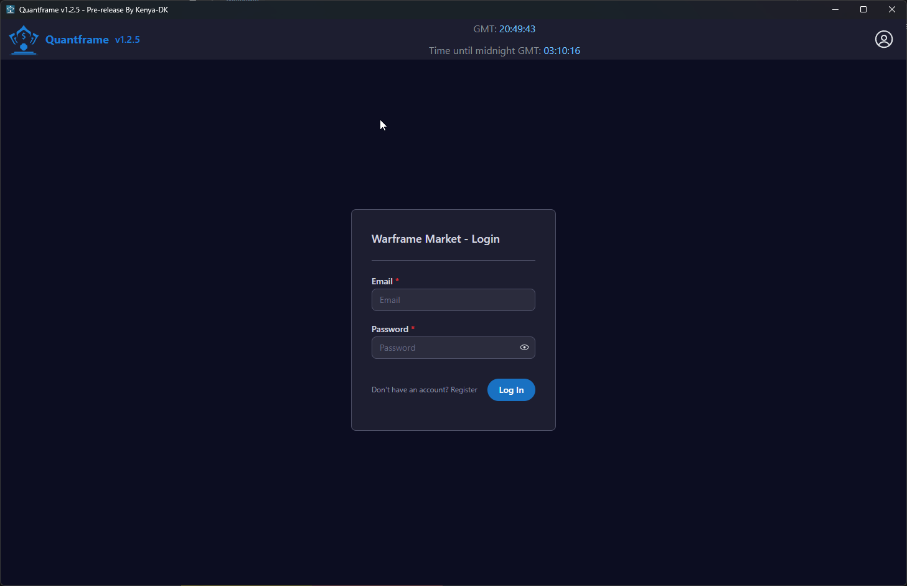
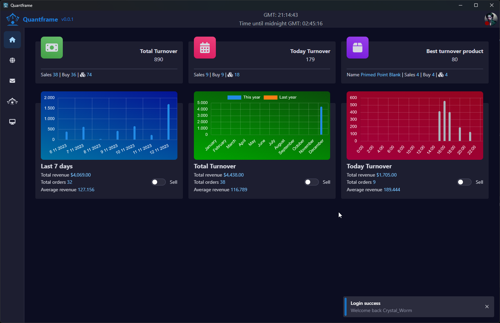
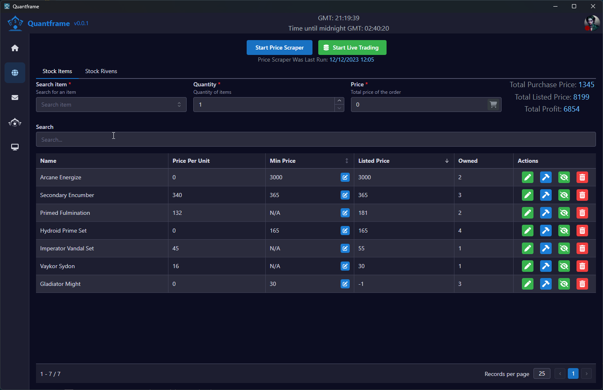

# QuantFrame

Inspired by [Akmayer's Warframe-Algo-Trader](https://github.com/akmayer/Warframe-Algo-Trader), this is a re-implementation using tauri. Tauri allows for easy distribution to windows & linux without technical knowledge.

## Features

- Distribute as windows
  - Install size: 35MB
  - Idle resource consumption: 60MB, extremely small cpu footprint (on my rig, 0-0.1%)
  - Update distribution
- Save data in sqllite db located at `C:\Users\*\AppData\Local\dev.kenya.quantframe\quantframe.sqlite`
- Logs and setings wil be save at `C:\Users\*\AppData\Local\dev.kenya.quantframe`
  - easily inspectible with db tools like https://beekeeperstudio.io
- Api client to communicate with wf.market
- Easy debugging / developer experience via edge dev tools

## Screenshots







## Installation

### Download installer

You can download the latest release from [here](https://github.com/Kenya-DK/quantframe-react)

### OR Build it from source

If you prefer to build it locally for whatever reason, heres what you need:

#### Step 1. Install Pre-Requisites

Follow the [Tauri Pre-requisites](https://tauri.app/v1/guides/getting-started/prerequisites) guide to get necessary dependencies.

> If you're using **Windows**, you CANNOT use WSL for this project. You MUST install pre-requisites on windows, not WSL.

You will also need to make sure you've got Nodejs installed.

#### Step 2. Download code

I would strongly recommend installing [git](https://git-scm.com/) or [Github Desktop](https://desktop.github.com/) and use those to download the project source code from github. The reason is this will allow you to download new versions of the code much easier than clicking "download zip" every time.

##### Step 2.1. Delete

delete the `pubkey` filed in `tauri/src-tauri/tauri.conf.json`.

#### Step 3. Build the project

Open a terminal at the project root and run:

<details>
<summary>
<i>How do I do this on windows?</i>
</summary>

On windows, this is easily done by click the path:


Then type in `powershell` and hit enter


</details>

```bash
pnpm i # Install nodejs deps
pnpm run tauri build
```

> For developers, you can also use yarn or pnpm if you prefer. (pnpm is the fastest package manager)

## About the project

This project uses:

- [Tauri](https://tauri.app): like electron but using a [Rust](https://www.rust-lang.org/) backend and doesn't use Chromium, leading to better performance.
- [React](https://react.dev/): For the frontend.
- [Mantine](https://mantine.dev/): use for the UI.
- [Sqlite](https://www.sqlite.org/index.html): For the database.
